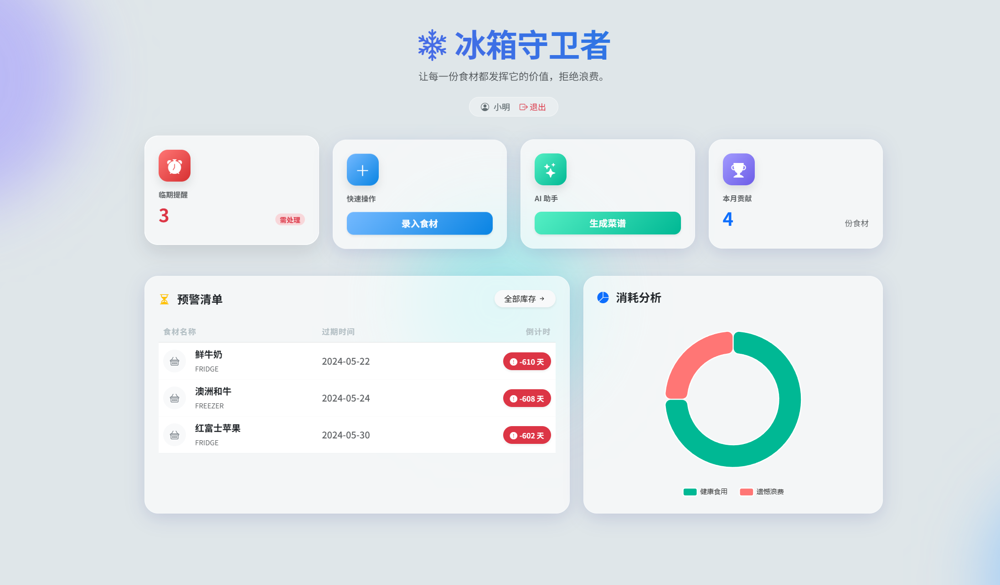
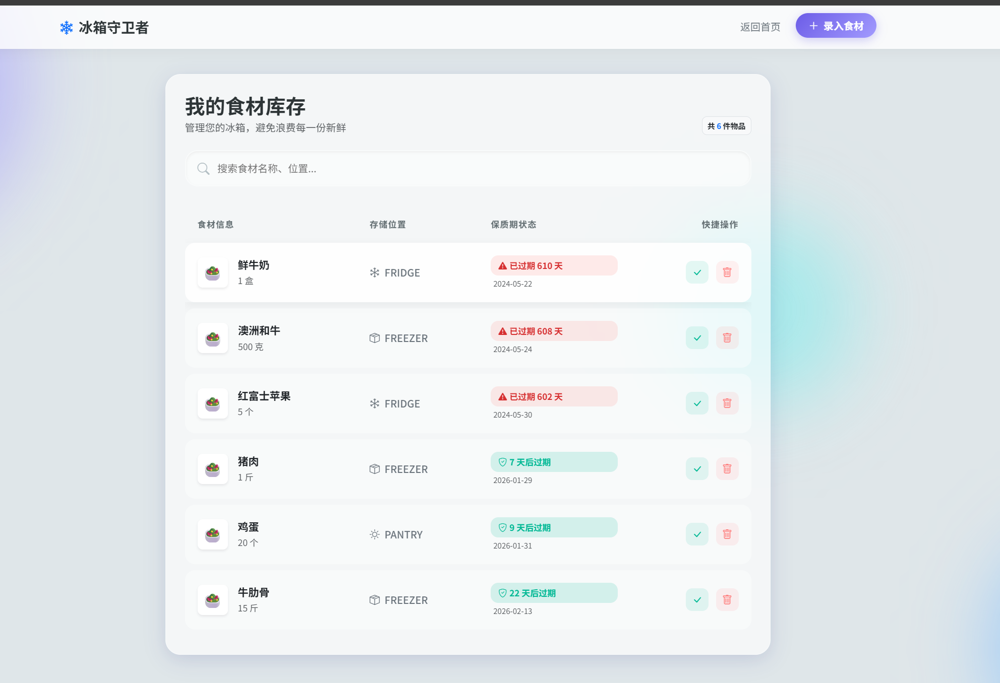
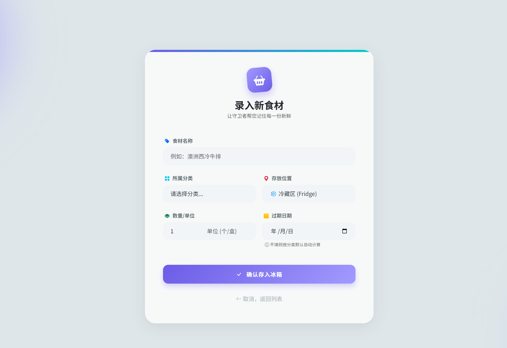
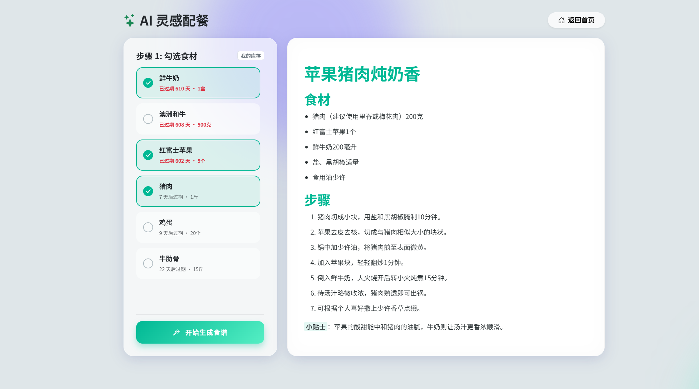

# 🧊 冰箱守卫者 (Fridge Guardian)

> **您的智能食材管家 —— 让每一份食材都物尽其用，拒绝浪费，美味加倍。**

   

## 📖 项目简介

**冰箱守卫者 (Fridge Guardian)** 是一款基于 **Spring Boot** 和 **AI 技术** 的智能食材管理系统。

在快节奏的生活中，我们经常忘记冰箱里有什么，导致食材过期浪费，或者面对一堆剩菜不知道吃什么。本项目旨在解决这些痛点：它不仅能帮助用户**可视化管理库存**、**自动监控保质期**，还能利用 **AI 大模型** 根据现有食材**智能生成创意食谱**，助您开启绿色、健康的饮食生活。

---

## ✨ 核心功能

### 1. 🛡️ 智能库存管理
- **可视化录入**：支持分类（蔬菜、肉类、水果等）、数量、存放位置（冷藏/冷冻/常温）的详细记录。
- **过期时间自动计算**：根据不同食材分类，自动推算建议保质期，同时支持手动指定。

### 2. ⏰ 自动化临期预警
- **后台巡检**：集成 Spring Task 定时任务，后台全天候自动扫描库存。
- **状态可视化**：前端列表通过不同颜色的徽章（🟢新鲜 / 🟠临期 / 🔴过期）直观展示食材状态。
- **人性化提示**：精确到天的倒计时显示（如“明天过期”、“已过期 2 天”）。

### 3. 🤖 AI 灵感配餐
- **智能算法**：接入大语言模型（LLM）API。
- **剩菜大作战**：用户只需勾选冰箱里现有的食材，AI 即可生成详细的烹饪步骤和营养分析，解决“今晚吃什么”的世纪难题。
- **Markdown 渲染**：生成的食谱排版精美，阅读体验极佳。

### 4. 📊 消费数据看板
- **可视化图表**：集成 **ECharts**，首页展示“健康食用”与“遗憾浪费”的比例饼图。
- **数据统计**：实时统计库存总量及临期食品数量，帮助用户优化购买习惯。

### 5. 🔐 安全与性能
- **用户认证**：采用 **Apache Shiro + JWT** 实现无状态认证，支持 Token 自动续期。
- **数据加密**：用户密码采用 BCrypt 强哈希加密存储。
- **性能优化**：引入 **Redis** 缓存热点数据（如食材分类、用户信息），大幅提升响应速度。

---

## 🛠️ 技术栈

### 后端 (Backend)
- **核心框架**: Spring Boot 3.x
- **持久层**: MyBatis Plus
- **权限安全**: Apache Shiro, JWT (JSON Web Token)
- **缓存**: Redis (Spring Cache)
- **定时任务**: Spring Task
- **工具库**: Hutool, Lombok, Fastjson2

### 前端 (Frontend)
- **模板引擎**: Thymeleaf
- **UI 框架**: Bootstrap 5 (响应式布局)
- **图表库**: Apache ECharts
- **交互**: Vanilla JS + Fetch API (原生异步请求)
- **设计风格**: 新拟态 (Neumorphism) + 毛玻璃 (Glassmorphism)

### 数据库 & 环境
- **数据库**: MySQL 8.0
- **构建工具**: Maven
- **运行环境**: JDK 17+

---

## 如图介绍

### 1. 登录/注册页面

### 2. 主页

### 3. 食材管理

### 4. 食材过期监控 (10s一换 ，应该每次登录是提示的)

### 5.ai助手配餐
